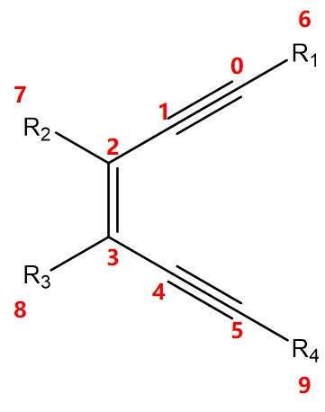

| Index | Atomic number                  | Training set loss | Test set loss |
| ----- | ------------------------------ | ----------------- | ------------- |
| 0     | [0, 5]                         | 1.98              | 5.68          |
| 1     | [2, 3]                         | 2.14              | 12.93         |
| 2     | [0, 2, 3, 5]                   | 2.02              | 6.42          |
| 3     | [0, 1, 4, 5]                   | 1.96              | 6.17          |
| 4     | [0, 1, 2, 3, 4, 5]             | 2.00              | 5.85          |
| 5     | [6, 0, 1, 2, 3, 4, 5, 9]       | 1.99              | 4.94          |
| 6     | [0, 1, 2, 7, 8, 3, 4, 5]       | 2.01              | 7.31          |
| 7     | [6, 0, 1, 2, 7, 8, 3, 4, 5, 9] | 2.03              | 4.69          |
| 8     | [0, 1, 2, 3, 4, 5, 6, 7, 8, 9] | 1.80              | 4.96          |
| 9     | [5, 3, 2, 1, 0, 4]             | 1.99              | 8.99          |
| 10    | [5, 2, 2, 1, 3, 4]             | 1.98              | 8.83          |
| 11    | [0, 1, 2]                      | 1.81              | 10.36         |
| 12    | [5, 4, 3]                      | 2.20              | 10.42         |

The atomic number represents the selected atomic sequence, as defined in the standard shown in the diagram. From 0 to 7, as the selected input feature atoms change, it becomes evident that including more atoms does not necessarily yield better results.

In the Bergman training set, the loss function hits a bottleneck at 2.0 kcal/mol, meaning it's difficult to reduce the loss further. To improve performance, the model itself needs to be modified. Therefore, the selected atom sequence has been defined as [6, 0, 1, 2, 7, 8, 3, 4, 5, 9], which includes the maximum number of atoms and the richest information. This also presents a greater challenge for our model.

Comparing selections 9, 10, and 4, the order of atoms is important, but not overwhelmingly so. If the selected order is "geometrically elegant," sufficient training iterations can eventually allow the model to learn the features.

The comparisons between 11 and 12 also reveal that relying solely on one side's atomic information is far from sufficient.

